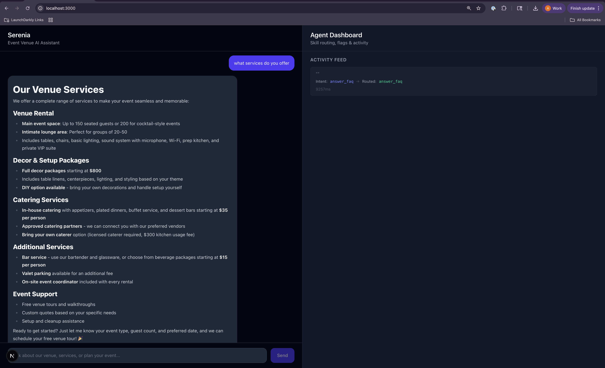

# Serenia — Event Venue AI Agent

A full-stack AI-powered customer service agent for an event venue business. Features intent detection, skill routing, LaunchDarkly feature flags, and Datadog observability (Guarded Rollouts).



## Tech Stack

- **Backend:** Python 3.12, FastAPI, Anthropic Claude Sonnet 4
- **Frontend:** Next.js 15, React 19, TypeScript, Tailwind CSS 4
- **Feature Flags:** LaunchDarkly
- **Observability:** Datadog APM (ddtrace)
- **CRM:** Airtable

## Prerequisites

- Python 3.12+
- Node.js 18+
- An [Anthropic API key](https://console.anthropic.com/)
- A [LaunchDarkly](https://launchdarkly.com/) account
- (Optional) [Datadog](https://www.datadoghq.com/) account for APM tracing
- (Optional) [Airtable](https://airtable.com/) account for CRM integration

## Setup

### 1. Clone the repo

```bash
git clone <repo-url>
cd serenia-agent-skills
```

### 2. Configure environment variables

Copy the example env file and fill in your keys:

```bash
cp .env.example .env
```

| Variable | Required | Description |
|----------|----------|-------------|
| `ANTHROPIC_API_KEY` | Yes | Anthropic API key |
| `LD_SDK_KEY` | Yes | LaunchDarkly server-side SDK key |
| `LD_CLIENT_SIDE_ID` | Yes | LaunchDarkly client-side ID |
| `DD_API_KEY` | No | Datadog API key |
| `DD_SITE` | No | Datadog site (e.g. `us5.datadoghq.com`) |
| `DD_AGENT_HOST` | No | Datadog agent host (default: `localhost`) |
| `DD_LLMOBS_ML_APP` | No | Datadog LLM Observability app name |
| `OTEL_RESOURCE_ATTRIBUTES` | No | OpenTelemetry resource attributes |
| `AIRTABLE_PAT` | No | Airtable personal access token |
| `AIRTABLE_BASE_ID` | No | Airtable base ID |

### 3. Install backend dependencies

```bash
python -m venv venv
source venv/bin/activate
pip install -r requirements.txt
```

### 4. Install frontend dependencies

```bash
cd ui
npm install
```

## Running the App

### Option A: Full-stack (API + UI)

Start the backend API server:

```bash
uvicorn server:app --reload --port 8000
```

In a separate terminal, start the frontend:

```bash
cd ui
npm run dev
```

Open [http://localhost:3000](http://localhost:3000) to use the app.

### Option B: CLI demo

Run a set of demo messages through the agent without the UI:

```bash
python main.py
```

## API Endpoints

| Method | Path | Description |
|--------|------|-------------|
| `GET` | `/api/skills` | Returns the skill registry |
| `GET` | `/api/activity` | Returns the activity log |
| `POST` | `/api/chat` | Process a customer message |

## Skills

| Skill | Status | Description |
|-------|--------|-------------|
| `answer_faq` | Stable | Answers venue questions using a knowledge base + Claude |
| `log_inquiry` | Stable | Logs prospect info to Airtable |
| `qualify_lead` | Flag-gated | Scores leads (hot/warm/cold) and determines follow-up action |
| `auto_propose` | Locked | Coming soon — generates custom event proposals |

## Airtable Setup (Optional)

If using the Airtable CRM integration, create a **Leads** table with these fields:

- `Name` — Single line text
- `Email` — Email
- `Message` — Long text
- `Status` — Single select (`New`, `Qualified`)
- `Lead Score` — Single select (`Hot`, `Warm`, `Cold`)
- `Lead Action` — Single line text
- `Qualification Reason` — Long text

## Datadog Agent (Optional)

A `docker-compose.yml` is included for running the Datadog Agent container for APM trace forwarding:

```bash
docker compose up -d
```

## Project Structure

```
serenia-agent-skills/
├── main.py                 # CLI demo entry point
├── server.py               # FastAPI server
├── requirements.txt        # Python dependencies
├── Dockerfile
├── docker-compose.yml      # Datadog Agent container
├── .env.example            # Environment variable template
├── data/
│   └── knowledge_base.json # FAQ data for answer_faq skill
├── docs/                   # Additional documentation
├── serenia/
│   ├── agent.py            # Core routing + intent detection
│   ├── flags.py            # LaunchDarkly initialization
│   ├── skills/
│   │   ├── answer_faq.py
│   │   ├── log_inquiry.py
│   │   ├── qualify_lead.py
│   │   └── airtable_client.py
│   └── observability/
│       ├── tracing.py      # Datadog APM setup
│       └── ld_hook.py      # LaunchDarkly → Datadog span tagging
└── ui/                     # Next.js frontend
    ├── src/
    │   ├── app/page.tsx    # Main split-screen UI
    │   └── components/     # Chat & Dashboard components
    └── package.json
```
